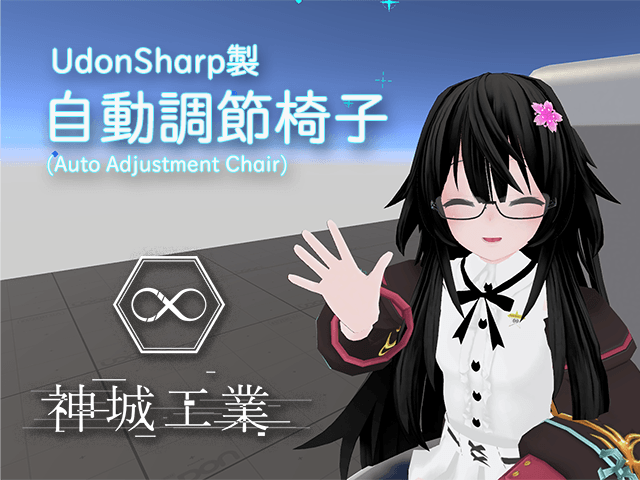

# Auto Adjustment Chair -AAChair- for VRCSDK3 UDON

version 2.0.0
[Japanese Readme][00]  

CreatedBy：AoiKamishiro([@aoi3192][01])  

## About
A chair that automatically adjusts the seating position. Since it is calculated based on the avatar's bone information, it will adjust regardless of the animation specifications.  
[Booth Page][71]  

## Download
Please download the latest version from the [Release][21] page.  

## Install  
1. Import the latest versions of VRCSDK3 and UdonSharp before you start.  
2. Place 00Kamishiro/AAChair/AAchair.prefab in the scene.  
3. If necessary, replace the chair model.  
4. Move the AdjustPoint in the prefab to the position where you want the back of the knee to be when seated.  

## Terms of Use  
* The assets in the UnityPackage are distributed under the [MIT License][61].  

### Contact  
[Ind.Kamishiro Discrod Server][81]  
[Twitter: @aoi3192][82]  
[VRChat: 神城アオイ][83]  
  
## 関連サイト  
[Booth][91]  
[Vket][92]  
[Github][93]  

[00]:AAChair-README_JP.md
[01]:https://twitter.com/aoi3192
[21]:https://github.com/AoiKamishiro/VRChatPrefabs/releases
[61]:https://github.com/AoiKamishiro/VRChatPrefabs/blob/master/LICENSE
[71]:https://kamishirolab.booth.pm/items/3052333
[81]:https://discord.gg/8muNKrzaSK
[82]:https://twitter.com/aoi3192
[83]:https://www.vrchat.com/home/user/usr_19514816-2cf8-43cc-a046-9e2d87d15af7
[91]:https://kamishirolab.booth.pm/
[92]:https://www.v-market.work/ec/shops/1810/detail/
[93]:https://github.com/AoiKamishiro