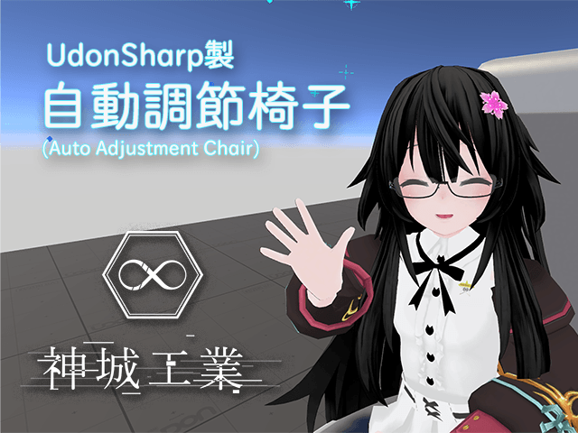

# VRCSDK3 Udon用 自動調節椅子 AAChair

version 1.0.2  
[English Readme][00]  

制作：神城アオイ([@aoi3192][01])  

## 概要
着席位置を自動で調節する椅子です。アバターのボーン情報を元に算出するので、アニメーションの仕様に関係なく調節されます。  
[Booth配布ページ][71]  

## ダウンロード
[リリース][21]ページより最新版のダウンロードをお願いします。  

## 導入方法  
1. 事前に、VRCSDK3 と UdonSharp の最新版のインポートをしてください。  
2. 00Kamishiro/AAChair/AAchair.prefab をシーン内に設置してください。  
3. 必要に応じて椅子のモデルの差し替えを行ってください。  
4. 着席した時に膝の裏側が来てほしい位置に、プレハブ内の AdjustPoint を移動させてください。  

## 利用規約  
* UnityPackage内のアセットは、[MIT License][61]の下で配布しております。  

### 連絡先  
[神城工業 Discrod Server][81]  
[Twitter: @aoi3192][82]  
[VRChat: 神城アオイ][83]  
  
## 関連サイト  
[Booth: 神城工業][91]  
[Vket: 神城工業][92]  
[Github: 神城アオイ][93]  

[00]:AAChair-README_EN.md
[01]:https://twitter.com/aoi3192
[21]:https://github.com/AoiKamishiro/VRC_UdonPrefabs/releases
[61]:https://github.com/AoiKamishiro/VRC_UdonPrefabs/blob/master/LICENSE
[71]:https://kamishirolab.booth.pm/items/3052333
[81]:https://discord.gg/8muNKrzaSK
[82]:https://twitter.com/aoi3192
[83]:https://www.vrchat.com/home/user/usr_19514816-2cf8-43cc-a046-9e2d87d15af7
[91]:https://kamishirolab.booth.pm/
[92]:https://www.v-market.work/ec/shops/1810/detail/
[93]:https://github.com/AoiKamishiro