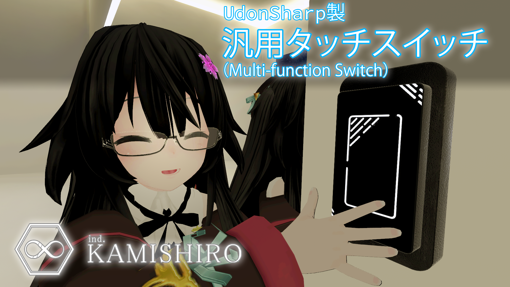

# Multi-function switch for VRCSDK3 Udon "AKSwitch"  

  

version 2.0.1  
[Japanese Readme][00]  

Created by Aoi Kamishiro ([@aoi3192][01])  
Icon: -Ohuton-([@Ohuton0501][02])  
Sound effect: \[ALO\](U-Stella)([@ALOHAGOTO][03])  

## Overview

This is a switch gimmick for SDK3.  
A single checkbox can be used to switch between local and global behavior.  
VR users can operate the switch by physical contact, while desktop users can operate it by conventional interaction.  
You can also switch the operation method at any time.  
[Booth distribution page][71].  

## Download  

Please download the latest version from the [Release][21] page.  

## How to install  

1. import the latest versions of VRCSDK3 and UdonSharp.  
2. place the prefabs of your choice in Assets\00Kamishiro\AKSwitch\Prefabs in your scene and use them.  

## Sample Scenes  

In order to use the sample scene, you will need the following additional assets.  

* [Collection of materials for VRChat with CC0](https://coquelicotz.booth.pm/items/2516986)  
* [VRChat Furniture Set(1)](https://coquelicotz.booth.pm/items/1276329)  
* [VRChat Furniture Set(2)](https://coquelicotz.booth.pm/items/1573249)  

### Accessible Udon Variables and Functions  

The following are supported for accessing Udon in AKSwitch  

* int State - The variable that contains the current state of the switch. The range of values is 1-5.  
* void OnInteracted() - Performs a click operation on the switch.  
* void _PhysicalMode() - Sets the switch to physical touch mode.  
* void _RaycastMode() - Sets the switch to interact mode.  

## Terms of Use  

* Assets\00Kamishiro\AKSwitch\_Resources\Textures\Icons.png may not be redistributed except for use in this switch. You may incorporate this switch into your sales world and sell it.  
* Assets\00Kamishiro\AKSwitch\_Resources\Audios\Click.ogg may not be redistributed except for use in this switch. You may incorporate this switch into your sales world and sell it.  
* Other assets in the Assets\00Kamishiro\AKSwitch\ are distributed under the [MIT License][61].  

### Contact  

[Kamishiro Industries Discrod Server][81].  
[Twitter: @aoi3192][82]  
[VRChat: Kamishiro Aoi][83]  

## Related sites  

[Booth: Kamishiro Industries][91]  
[Vket: Kamishiro Industries][92]  
[Github: Aoi Kamishiro][93]  

[00]:AKSwitch-README_JP.md
[01]:https://twitter.com/aoi3192
[02]:https://twitter.com/Ohuton0501
[03]:https://twitter.com/ALOHAGOTO
[21]:https://github.com/AoiKamishiro/VRChatPrefabs/releases
[61]:LICENSE-MIT
[71]:https://kamishirolab.booth.pm/items/3159633
[81]:https://discord.gg/8muNKrzaSK
[82]:https://twitter.com/aoi3192
[83]:https://www.vrchat.com/home/user/usr_19514816-2cf8-43cc-a046-9e2d87d15af7
[91]:https://kamishirolab.booth.pm/
[92]:https://www.v-market.work/ec/shops/1810/detail/
[93]:https://github.com/AoiKamishiro
