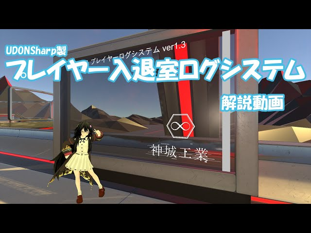

# PlayrtLogSystem GKLog for VRCSDK3 UDON

version 2.2  
[Japanese Readme][00]

Created by：Aoi Kamishiro([@aoi3192][01])  

## Overview
This is a gimmic that display a user's enter/exit logs in the world.  
It supports scrolling and backwards synchronization of the logs, and cam disoplay up to the latest 200 entries in the history.  
Is also has a simple ckock and player counter.  
[Booth Page][71]  

## Download
Please download the latest version from the [Release][21] page.  

## Installation
1. Import the latest verion of VRCSDK3 and UdonSharp beforehand.  
2. If the EventSyetem is not in the scene, create a UI/Canvas to generate it.  
3. Place the prefab in 00Kamishiro/GKLog in the scene.

### Prefabs
* GKLog_v2.2 - The prfab made with UI Text.  
* GKLog_v2.2T - The prfab made with TextMeshPro.  

## Terms of Use
* The assets in UnityPackage are distributed under the [MIT License][61].  

### Contact
[Ind.Kamishiro Discrod Server][81]  
[Twitter: @aoi3192][82]  
[VRChat: AoiKamishiro][83]  

## SItes
[Booth: Ind.Kamishiro][91]  
[Vket: Ind.Kamishiro][92]  
[Github: AoiKamishiro][93]  

[00]:GKLog-README_JP.md
[01]:https://twitter.com/aoi3192
[21]:https://github.com/AoiKamishiro/VRChatPrefabs/releases
[61]:https://github.com/AoiKamishiro/VRChatPrefabs/blob/master/LICENSE
[71]:https://kamishirolab.booth.pm/items/2521621
[81]:https://discord.gg/8muNKrzaSK
[82]:https://twitter.com/aoi3192
[83]:https://www.vrchat.com/home/user/usr_19514816-2cf8-43cc-a046-9e2d87d15af7
[91]:https://kamishirolab.booth.pm/
[92]:https://www.v-market.work/ec/shops/1810/detail/
[93]:https://github.com/AoiKamishiro