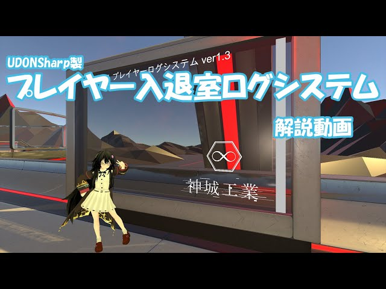

# VRCSDK3 Udon用 プレイヤーログシステム GKLog

version 2.0  
<!-- [English Readme][00] -->

制作：神城アオイ([@aoi3192][01])  

## 概要
ワールド内にユーザーの入退室のログを表示するギミックです。  
ログのスクロール及び後入り同期に対応しており、直近200件までの履歴を表示可能です。  
また、簡易的な時計とプレイヤーカウンターも備えています。
[Booth配布ページ][71]

## ダウンロード
[リリース][21]ページより最新版のダウンロードをお願いします。  

## 導入方法
1. 事前に、VRCSDK3 と UdonSharp の最新版のインポートをしてください。
2. EventSystem がシーン上に無い場合は、UI/Canvas を作るなどして生成させてください。  
3. 00Kamishiro/GKLog 内のお好みのプレハブをシーン内に設置してください。  

### 各プレハブの相違
* GKLog_v2.0 - UI Text を使用したプレハブです。 
* GKLog_v2.0_TMP -  TextMeshPro を使用したプレハブです。 

## 利用規約
* UnityPackage内のアセットは、[MIT License][61]の下で配布しております。  

### 連絡先
[神城工業 Discrod Server][81]  
[Twitter: @aoi3192][82]  
[VRChat: 神城アオイ][83]  

## 関連サイト
[Booth: 神城工業][91]  
[Vket: 神城工業][92]  
[Github: 神城アオイ][93]  

<!-- [00]:README-en.md -->
[01]:https://twitter.com/aoi3192
[21]:https://github.com/AoiKamishiro/VRC_UdonPrefabs/releases
[61]:https://github.com/AoiKamishiro/VRC_UdonPrefabs/blob/master/LICENSE
[71]:https://kamishirolab.booth.pm/items/2521621
[81]:https://discord.gg/8muNKrzaSK
[82]:https://twitter.com/aoi3192
[83]:https://www.vrchat.com/home/user/usr_19514816-2cf8-43cc-a046-9e2d87d15af7
[91]:https://kamishirolab.booth.pm/
[92]:https://www.v-market.work/ec/shops/1810/detail/
[93]:https://github.com/AoiKamishiro